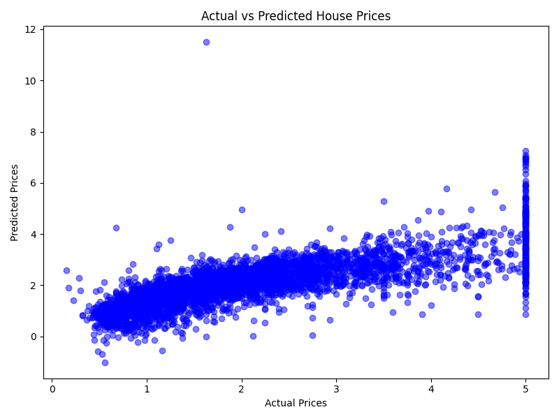

# 🏠 House Price Prediction using Machine Learning

This project predicts house prices using a Machine Learning model trained on the California Housing dataset.

---

## 📊 Dataset
California Housing Dataset  
Total Records: **20,640**

Features include:
- Median Income
- House Age
- Average Rooms
- Average Bedrooms
- Population
- Latitude
- Longitude

---

## 🧠 Machine Learning Model
**Linear Regression**

---

## 📈 Model Performance
- R² Score: **0.58**
- Mean Squared Error: **0.56**

---

## 🛠 Technologies Used
- Python
- Pandas
- NumPy
- Scikit-learn
- Matplotlib

---

## 📷 Output Graph



---

## 🚀 How to Run the Project

Install dependencies:

```bash
pip install pandas scikit-learn matplotlib
```

Run the project:

```bash
python house_price.py
```

---

## 👨‍💻 Author

**Anant**  
AIML Student | Machine Learning Enthusiast
